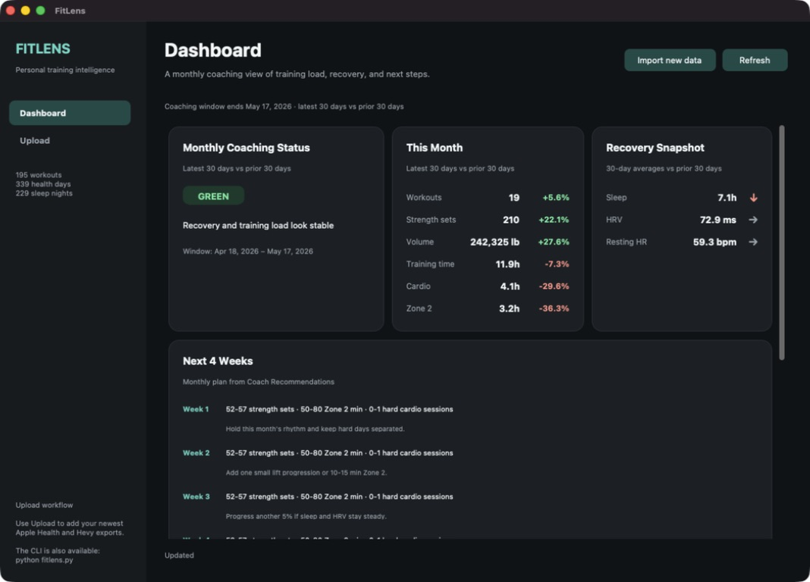
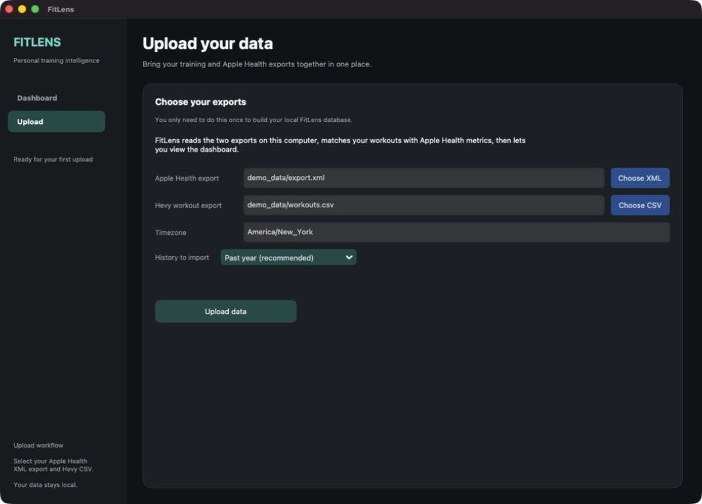

# FitLens

FitLens is a local desktop fitness dashboard that combines an Apple Health export with a Hevy workout export. It turns those files into monthly coaching notes, recovery trends, training-load comparisons, priority actions, and a simple four-week plan.

Your health and workout data stays on your computer. FitLens does not require an account, API key, cloud database, or paid service.



## Before you start

You need:

- Python **3.12** (the version used to build and test this project)
- an Apple Health export named `export.xml`
- a Hevy workout-history export named `workouts.csv`
- Tk support for Python if you want to use the desktop app

FitLens currently expects both exports. If you only have one of them, the import cannot be completed.

### Export your data

**Apple Health (iPhone)**

1. Open the **Health** app.
2. Tap your profile picture.
3. Tap **Export All Health Data**, then **Export**.
4. Save or transfer the ZIP file to the computer running FitLens.
5. Unzip it. The file FitLens needs is `apple_health_export/export.xml`.

Large Apple Health exports are normal and may take a while to unzip and import.

**Hevy**

1. Open Hevy.
2. Open **Settings**.
3. Choose **Export Workout Data**.
4. Save or transfer the resulting `workouts.csv` file to the computer running FitLens.

## Install FitLens

Open a terminal in the folder where you cloned or downloaded this repository.

### macOS

Install Python 3.12 and its Tk support if needed:

```bash
brew install python@3.12 python-tk@3.12
```

Create an isolated environment and install FitLens:

```bash
python3.12 -m venv .venv
source .venv/bin/activate
python -m pip install --upgrade pip
python -m pip install -r requirements.txt
```

### Windows

Install the 64-bit Python 3.12 release from [python.org](https://www.python.org/downloads/). Keep **tcl/tk and IDLE** selected in the installer; it is included by default. Then run:

```powershell
py -3.12 -m venv .venv
.venv\Scripts\Activate.ps1
python -m pip install --upgrade pip
python -m pip install -r requirements.txt
```

If PowerShell blocks activation, you can skip it and use `.venv\Scripts\python.exe` in place of `python` in the commands below.


## Run the desktop app

With the virtual environment active, run:

```bash
python fitlens-desktop.py
```

On Windows, the no-activation equivalent is:

```powershell
.venv\Scripts\python.exe fitlens-desktop.py
```

### First-time walkthrough

1. Select **Upload** in the left sidebar.
2. Choose the Apple Health `export.xml` file.
3. Choose the Hevy `workouts.csv` file.
4. Check the timezone. Use a standard name such as `America/New_York`, `America/Chicago`, or `Europe/London`.
5. Choose how much history to import. **Past year** is the recommended starting point.
6. Select **Upload data**. Keep FitLens open while it scans the files.
7. When the upload finishes, open the dashboard.



The dashboard compares the latest 30 days in your imported data with the previous 30 days. Its date window ends on the newest date in your export, which may be earlier than today. Scroll down to see the four-week plan and priority actions.

When you have newer exports, select **Import new data** or **Upload**, choose the latest files, and upload again. FitLens reconciles them with the existing local data instead of intentionally duplicating the previous import.

## Try it without personal data

The repository includes synthetic data covering 120 days. On the Upload screen, choose:

- Apple Health export: `demo_data/export.xml`
- Hevy workout export: `demo_data/workouts.csv`
- Timezone: `America/New_York`

The demo files contain no real health information.

## Optional terminal interface

If the desktop window is unavailable or you prefer a guided terminal menu, run:

```bash
python fitlens-cli.py
```

Follow the prompts to import data and open coaching, movement balance, recent workouts, weekly summaries, recovery trends, or data coverage. The terminal interface does not use command-line flags.

## Your data and privacy

FitLens creates `fitlens.db` in the project folder. This local SQLite file contains the imported health and workout information used by both interfaces.

- Do not commit or share `fitlens.db`; the repository's `.gitignore` excludes database files.
- Back up `fitlens.db` yourself if you want to preserve the imported history.
- Delete `fitlens.db` while FitLens is closed if you deliberately want to reset the app and import from scratch.
- No API keys or environment variables are required. The recommendations are local and rule-based, not sent to an AI service.

## Troubleshooting

### The desktop window does not open or `_tkinter` is missing

Your Python installation does not include Tk support. On macOS with Homebrew, run `brew install python-tk@3.12`, recreate `.venv`, and reinstall the requirements. On Windows, modify or reinstall Python and include **tcl/tk and IDLE**. You can use `python fitlens-cli.py` as a fallback.

### `python` or `python3.12` is not found

Close and reopen the terminal after installing Python. On Windows, try `py -3.12`; on macOS, try the Homebrew command shown above. Make sure you are running commands from the FitLens folder.

### FitLens says to choose a valid XML or CSV

Select the unzipped Apple Health `export.xml`, not the ZIP file, and select Hevy's `workouts.csv`. Moving an export after selecting it also invalidates the saved path.

### FitLens cannot find the timezone

Use an IANA timezone name such as `America/New_York` rather than an abbreviation such as `EST`. On systems with missing timezone data, install it with `python -m pip install tzdata`, then restart FitLens.

### Importing appears slow

Apple Health exports can contain millions of records. The screen reports how many records have been scanned; leave the app open until it completes. Starting with **Past 6 months** or **Past year** reduces the amount of data FitLens writes, although it still has to scan the XML export.

### The dashboard shows older dates

This is expected when the export is old. Dashboard windows are anchored to the newest data in `fitlens.db`, not the current date. Export fresh files and use **Import new data**.

### An import fails with another message

Check that both files open normally, confirm there is enough free disk space, and retry. The terminal interface saves technical details to `fitlens_error.log`; include that file when reporting a reproducible problem, but review it before sharing in case a local file path is sensitive.

## Current limitations

- FitLens is source-run software in this repository; there is no supported signed installer here yet.
- It is designed around Apple Health XML and Hevy CSV exports and does not sync directly with either service.
- Updating data requires exporting and importing the files again.
- Coaching is informational, rule-based fitness guidance. It is not medical advice.
- Exercise movement classification uses known exercise names and pattern matching, so an unfamiliar machine or custom exercise may appear as unclassified.
- The desktop interface focuses on the monthly dashboard and upload flow. The terminal interface contains additional detailed views.
- Linux is expected to work with Python and Tk installed, but the current project has primarily been used with Python 3.12 on macOS.

For architecture, database tables, code flow, known issues, and takeover notes, see the [FitLens Developer Guide](docs/DEVELOPER_GUIDE.md). The original revised planning document is also available in [docs](docs/FitLens_ProjectSpec_Revised.md).
