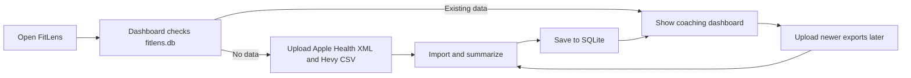
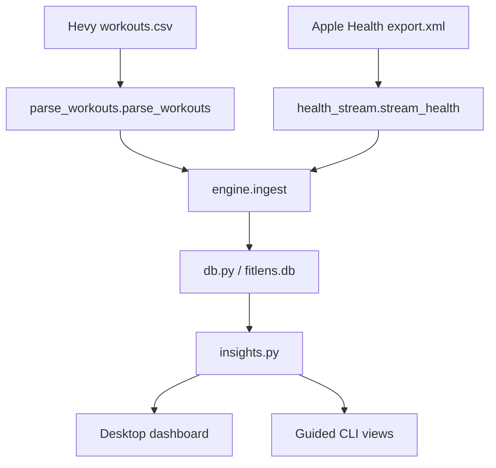

# FitLens Developer Guide

This is the document I would want if I had to hand FitLens to another developer and could not explain it in person. The [README](../README.md) is the end-user guide. It covers installing Python, getting the Apple Health and Hevy exports, and running the app. This guide starts after that and focuses on how the project actually works.

## Project overview

FitLens is a local Python fitness-analysis app. It combines a Hevy workout-history CSV with an Apple Health XML export, saves the useful parts in SQLite, and builds rule-based coaching summaries from the latest data.

I kept the project local on purpose. There is no server, user account, API key, cloud database, or AI request. Health data stays in `fitlens.db` on the user's computer.

There are two interfaces over the same backend:

- `fitlens-desktop.py` starts the CustomTkinter desktop app. This is the main interface.
- `fitlens-cli.py` starts the guided Rich/Questionary terminal interface. It also exposes some detailed views that I have not moved into the desktop app yet.

The current desktop app has two main sections: Dashboard and Upload. The dashboard shows monthly coaching status, the latest 30 days compared with the prior 30 days, a recovery snapshot, priority actions, and a four-week plan.


## What is actually implemented

The revised planning spec is in [FitLens_ProjectSpec_Revised.md](FitLens_ProjectSpec_Revised.md). Some of that document still describes the planned final GUI, so this is the shorter current-state version.

### Finished and working

- Guided Apple Health XML and Hevy CSV import
- Streaming Apple Health parsing instead of loading the whole XML file into memory
- Hevy workout and set parsing
- Local SQLite storage using WAL mode
- Stable IDs and duplicate-resistant inserts for workouts and sets
- Workout-window Apple Health summaries, including heart rate and other supported metrics
- Daily health, sleep-night, and Apple Workout summaries
- Latest-30-days versus prior-30-days coaching calculations
- Green/yellow/red readiness rules with human-readable reasons
- Up to six ranked recommendations and a generated four-week plan
- Exercise-to-muscle classification and movement-balance calculations
- Desktop Dashboard and Upload screens
- Guided CLI screens for recommendations, movement balance, recent workouts, weekly summaries, recovery trends, and data coverage
- Synthetic demo exports in `demo_data/`

### Partly implemented

- The desktop interface only exposes the combined Dashboard and Upload flow. Recent Workouts, Weekly Training, Movement Balance, and full Data Coverage are still CLI-only.
- The movement taxonomy handles the exercise names I have covered, then uses ordered regular expressions as a fallback. Unknown or unusually named exercises can remain unclassified.
- Error messages are readable in the normal file-selection and import paths, but there is not a complete error type system for every malformed export case.

### Not implemented

- Live Apple Health or Hevy integrations
- Accounts, cloud sync, or multi-user support
- AI-generated recommendations
- Calendar-month selection
- A generated PDF coaching report
- Interactive charts or a full chart dashboard
- Database schema migrations
- A supported signed installer in the current repository
- An automated test suite

## Repository layout

| Path | Responsibility |
| --- | --- |
| `fitlens-desktop.py` | Small desktop entry point. Sets the CustomTkinter theme and starts `DashboardApp`. |
| `fitlens-cli.py` | Guided terminal onboarding, menu, formatting, and detailed report screens. |
| `engine.py` | Coordinates imports, date coverage, the repeat-import watermark, and `ImportReport`. |
| `parse_workouts.py` | Parses Hevy CSV rows into workout and set dictionaries. |
| `health_stream.py` | Streams Apple Health XML and produces workout, daily, sleep, and Apple Workout summaries. |
| `db.py` | Owns the SQLite schema, connection settings, inserts, upserts, and import metadata. |
| `insights.py` | Reads SQLite data and builds statistics, readiness, recommendations, plans, and CLI data views. |
| `taxonomy.py` | Normalizes exercise names and maps them to muscle leaves, groups, and movement patterns. |
| `common.py` | Small conversion and stable-ID helpers. |
| `desktop/desktop_app.py` | Main window, sidebar navigation, and view switching. |
| `desktop/desktop_onboarding.py` | Upload form, validation, background import thread, progress polling, and completion view. |
| `desktop/desktop_dashboard.py` | Responsive dashboard layout and card creation. |
| `desktop/desktop_data.py` | `DashboardData`, the small data boundary between the dashboard and backend. |
| `desktop/desktop_components.py` | Reusable cards, metric rows, and smooth scrolling. |
| `desktop/desktop_formatting.py` | Display formatting, trend arrows/colors, and local-timezone detection. |
| `desktop/desktop_theme.py` | Colors and history-window choices. |
| `demo_data/` | Fake exports for development and demonstrations. |

The code is mostly function-based. I did not build a large parser/service class hierarchy because the project did not need one.

The main UI inheritance is straightforward:

- `DashboardApp` inherits from `customtkinter.CTk`.
- `DashboardView`, `OnboardingView`, `DashboardCard`, and `MetricRow` inherit from `customtkinter.CTkFrame`.
- `SmoothScrollableFrame` inherits from `customtkinter.CTkScrollableFrame`.
- `DashboardData`, `ImportReport`, `Stat`, and `HealthResult` are dataclasses used to move structured results around.

## Developer setup

There are no extra developer credentials or administrator steps. Use the Python 3.12 virtual environment from the README.

The runtime packages are in `requirements.txt`:

- `customtkinter` for the desktop UI
- `rich` and `questionary` for the CLI
- `black` for formatting

Tk is supplied by the Python installation, not pip. Windows can also need the `tzdata` package if `zoneinfo` cannot find IANA timezones:

```bash
python -m pip install tzdata
```

The app reads and writes `fitlens.db` beside the entry-point scripts. Database files, WAL files, Python caches, and `fitlens_error.log` are ignored by Git.

Useful checks before committing a change are:

```bash
python -m black --check .
python -m compileall -q common.py db.py engine.py health_stream.py insights.py parse_workouts.py taxonomy.py desktop fitlens-desktop.py fitlens-cli.py
python -m pip check
git diff --check
```

There is currently no test directory, so these checks catch formatting, syntax, imports, broken dependencies, and whitespace problems but do not prove the calculations are correct. For any parser or recommendation change, I also run both interfaces with the files in `demo_data/` and compare the results before and after.

## User flow and code walkthrough

The normal user flow is:



### 1. Application startup

`fitlens-desktop.py` creates a `DashboardApp` with the path to `fitlens.db`. `DashboardApp.__init__()` builds the sidebar and content area, then calls `show_dashboard()`.

`DashboardView` schedules its first `refresh()` with `after_idle()`. `DashboardData.load()` calls three backend entry points:

- `insights.coach_recommendations()`
- `insights.recovery_summary()`
- `engine.db_snapshot()`

If there are no workouts yet, the dashboard shows an empty-state card with an Upload button. If data exists, it builds the coaching cards.

### 2. Choosing exports

The Upload sidebar button calls `DashboardApp.show_import()`. This uses `engine.db_snapshot()` to decide whether the user is importing for the first time or reconciling newer exports.

`OnboardingView` owns the form shown below. It suggests `~/Downloads/export.xml` and `~/Downloads/workouts.csv` when those exact files exist since thats where I have mine. It also detects a local timezone when possible and defaults the first import to the past year.


`OnboardingView.start_import()` validates both paths and constructs `ZoneInfo(timezone)`. It disables the controls, starts `_run_import()` on a daemon thread, and polls a `queue.Queue` from the Tk main thread. This matters because Apple Health imports can take long enough to make the app appear frozen if parsing is done directly in a button callback.

### 3. Coordinating an import

The desktop and CLI both call `engine.ingest()`. That function is the main import boundary.

For a first import, `_requested_floor()` converts the chosen history window into a UTC timestamp. On later imports, `import_meta.last_ingested_ts` becomes the watermark and FitLens rereads a 36-hour overlap so recent health and sleep data have a chance to settle.

The pipeline is:



`parse_workouts.parse_workouts()` uses `csv.DictReader`. It parses Hevy's local timestamps using `CSV_TIME_FMT`, attaches the selected `ZoneInfo`, and creates a SHA-1 workout ID from title, localized start time, and localized end time. It returns all workouts and sets as Python lists.

`engine.ingest()` inserts workouts in the requested coverage window and then calls `health_stream.stream_health()` with the Hevy workout windows that need health summaries.

### 4. Streaming Apple Health

`health_stream.stream_health()` uses `xml.etree.ElementTree.iterparse()` and clears processed root children. This keeps memory use much lower than loading the complete Apple Health XML tree.

For each supported `Record`, `_handle_record()` decides whether it belongs to:

- a Hevy workout window
- a daily health metric
- a sleep night

Workout matching uses `_windows_containing()`. It keeps the sorted workout start times, uses `bisect_right()` to find possible matches, and checks whether the health sample timestamp falls between each Hevy workout's start and end.

`Stat` accumulates count, total, minimum, maximum, first, and last values. At the end of the stream, `Stat.as_row()` creates the shape used by `workout_health_summary` and `daily_health`.

Sleep records are collected as segments. `_summarize_night()` groups segments separated by no more than three hours and calculates stage minutes, total sleep, awake time, and efficiency. Apple `<Workout>` elements are handled separately by `_handle_workout()`.

### 5. SQLite storage

`db.connect()` enables WAL journaling, normal synchronous mode, foreign keys, and the current schema. The schema is created with `CREATE TABLE IF NOT EXISTS` each time a connection opens.

| Table | What it stores | Duplicate behavior |
| --- | --- | --- |
| `workouts` | One Hevy workout | Stable SHA-1 primary key and `INSERT OR IGNORE` |
| `workout_sets` | Individual Hevy sets | Unique workout/exercise/index/type combination and `INSERT OR IGNORE` |
| `workout_health_summary` | Apple Health metrics inside a Hevy workout window | Replaced by workout and metric |
| `daily_health` | One aggregate per date and metric | Replaced by date and metric |
| `daily_sleep` | One aggregate per sleep-ending date | Replaced by date |
| `apple_workouts` | Apple Workout records | Stable SHA-1 primary key and `INSERT OR IGNORE` |
| `import_meta` | Coverage, watermark, timezone, file paths, and last-run time | Replaced by key |

`engine.ingest()` commits only after the import and metadata updates finish. The connection closes in `finally`, so an exception before the final commit does not intentionally commit a half-finished data import.

### 6. Insights and coaching

`insights.py` is the read/query layer. Its public functions return plain dictionaries and lists so both interfaces can format the same data differently.

`coach_recommendations()` finds the latest date represented in the database. It uses that date, not today's date, as the end of the current 30-day window. It then builds the previous 30-day comparison window and calls `_month_stats()` for each.

`_month_stats()` combines workout counts, duration, set volume, cardio estimates, recovery averages, and taxonomy results. `_readiness()` assigns:

- red for a serious flag or at least three flags
- yellow when one or more non-red flags exist
- green when no flags exist

The main thresholds currently include sleep below 6.5 or 7 hours, HRV falling more than 10%, resting heart rate increasing more than 5%, training time increasing more than 15% or 25%, and hard cardio rising while recovery is down.

`_build_recommendations()` turns those values into evidence/action/timeframe dictionaries, sorts them by priority, and returns at most six. `_monthly_plan()` converts the current workload and readiness into four weekly targets.

This is fitness guidance, not a medical model. If the rules change, keep the evidence strings and UI wording in sync with the actual thresholds.

### 7. Exercise taxonomy

`taxonomy.classify()` first normalizes equipment and brand words out of the exercise title. It then checks `EXERCISE_MAP` for exact exceptions and finally walks `FALLBACK_RULES` from top to bottom. First match wins, so specific expressions must stay above generic expressions such as `press`, `row`, or `curl`.

Targets use a simple fractional-set model: a primary muscle receives `1.0` and a supporting muscle receives `0.5`. `insights._month_stats()` rolls leaf muscles into groups and movement patterns.

When adding an exercise:

1. Use an exact `EXERCISE_MAP` entry when the normalized name is known and unusual.
2. Use a fallback expression only when it represents a real family of exercises.
3. Keep the rule above any broader expression that would also match it.
4. Run `insights.movement_balance()` on representative data and inspect the `unmapped` result.

## Known issues and limitations

### Major or data-affecting

**There is no automated test suite.** A takeover developer should treat parser, date-window, import, and recommendation changes as high risk until focused tests are added.

**Do not change timezone midway through the same database.** The timezone is part of each Hevy workout's localized timestamps, and those timestamps are part of the workout ID. Reimporting the same CSV with a different timezone can create a second set of workout IDs. The current workaround is to use the original timezone or close FitLens, move the old database somewhere safe, and rebuild `fitlens.db` from the complete exports.

**Repeat imports can write a partial first overlap day.** The watermark path rereads 36 hours, but daily rows are aggregated only from records after that exact timestamp and then replace the saved date/metric row. If the floor lands in the middle of a day, that first day's aggregate can become partial. A safer future fix is to round the health floor back to the start of the local day or merge partial aggregates correctly.

**Edits to an already imported Hevy set are ignored.** Workouts and sets use `INSERT OR IGNORE`. This prevents normal duplicates, but if a user corrects weight, reps, notes, or timing in Hevy and exports again, an existing row with the same unique key is not updated. Rebuilding the database from full exports is the current reliable workaround.

**The CSV contract is implicit.** `parse_workouts.py` expects Hevy columns such as `start_time`, `end_time`, `title`, and set fields. A renamed or differently formatted Hevy export can raise `KeyError` or `ValueError`. There is no version detector or column-level validation yet.

### Minor and UX issues

- Detailed CLI views have not all been moved into the desktop UI.
- Dashboard refresh queries run on the Tk main thread. The current database is small enough for this, but a much larger database could briefly stop window updates.
- The dashboard uses two columns below 900 pixels and three above it. There is no dedicated one-column small-window layout, although the app has a 900-pixel minimum width.
- The first screen is an empty Dashboard rather than automatically opening Upload. The visible Upload button and sidebar make the next step clear, but it is one extra click.
- Windows may fall back to `America/New_York` because the local-timezone detector mainly reads `/etc/localtime`. The user needs to verify the field.
- Missing optional Apple Health metrics produce sparse cards or recommendations. That is supported, but data coverage is easier to inspect in the CLI than the desktop app.
- Errors from malformed files can expose raw Python exception text in the desktop status area.

### Performance limits

- `iterparse()` keeps XML memory use reasonable, but every import still walks the complete Apple Health export. The history floor filters records after parsing their timestamps; it does not seek into the file. Repeated imports therefore remain roughly proportional to export size.
- Progress is reported every 200,000 Apple Health records, so a slow import can appear unchanged between updates.
- `parse_workouts()` loads all Hevy workouts and sets into lists before filtering the requested history window. This is fine for normal workout exports but is not a streaming CSV design.
- `_month_stats()` and the dashboard open several SQLite connections and run multiple aggregate queries. This is simple and readable, but caching or consolidated queries may matter with a much larger database.
- Sleep segments inside the selected import window are stored in memory until the XML stream finishes.

## Extending the project safely

### Adding an Apple Health metric

Add the short metric name to the appropriate `DAILY_SUM`, `DAILY_POINT`, `INTRA_SUM`, or `INTRA_POINT` set in `health_stream.py`. Sum metrics represent totals such as steps or energy. Point metrics represent sampled values such as heart rate or HRV. Then add the corresponding query/display behavior in `insights.py` and one or both interfaces.

### Supporting another workout CSV format

Keep `engine.ingest()` working with the same workout and set dictionary shapes. A new parser can normalize a different source into those shapes instead of spreading source-specific columns through the rest of the project. Add a `source` value and define a stable workout ID that does not change across repeat exports.

### Changing recommendation rules

Keep thresholds in one calculation path, return the evidence behind the result, and test missing baselines as well as normal values. Avoid presenting a percentage change when the previous value is zero. Verify that readiness, recommendations, the four-week plan, CLI wording, and dashboard wording still agree.

## Future work

The most useful product additions would be:

- Move Recent Workouts, Weekly Training, Movement Balance, Recovery Trends, and Data Coverage into desktop screens.
- Add a backup/restore action for `fitlens.db`.
- Add a clear database reset flow instead of asking users to delete a file manually.
- Add a last-import summary and better coverage warnings to the dashboard.
- Add a few simple trend charts after the underlying calculations have tests.
- Create signed macOS and Windows installers that store the database in the normal per-user application-data folder.
- Add an optional generated monthly report.

Live APIs, cloud accounts, and AI coaching would change the privacy and deployment model enough that I would treat them as separate project phases, not small add-ons.


The most important design rule is still the original one: keep the parser, storage, and insight code independent from the interface. That is what lets the desktop app and CLI share one source of truth without rewriting the fitness logic twice.
